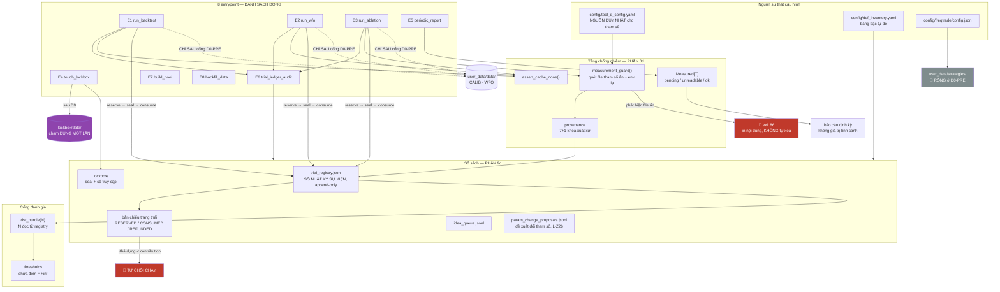
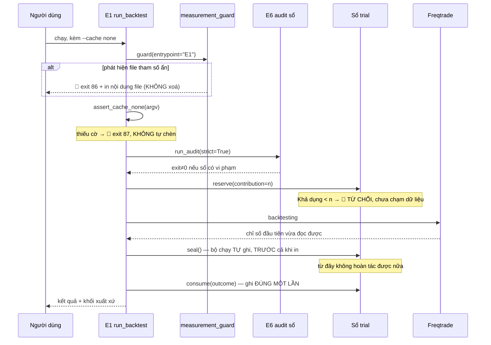

# ARCHITECTURE.md — Tool D (Smart DCA)

> Tạo ở Giai đoạn 2 của quy trình vibe-code, ngày 06/09/2026.
> Nguồn sự thật kỹ thuật: `tool-d-smart-dca.md` (v8). File này mô tả **cách tổ chức mã nguồn**,
> không chép lại nội dung chiến lược.
> Xem sơ đồ Mermaid bằng `Ctrl+K V` trong VS Code.

---

## 1. Ý tưởng kiến trúc trong một câu

Tool D không phải "một con bot". Nó là **một cái cân và một cuốn sổ**, bên trong có một con bot.

Cái cân (PHẦN 0d — toàn vẹn phép đo) đảm bảo mọi con số sinh ra là thật.
Cuốn sổ (PHẦN 9c — quản trị phép thử) đảm bảo ta không thử quá nhiều lần rồi tự lừa mình bằng
cấu hình may mắn nhất. Con bot (Freqtrade strategy) chỉ là thứ được cân — và nó **chưa được viết**.

Hệ quả kiến trúc: **cân và sổ phải hoạt động trước, và phải chặn được con bot khi chúng chưa sẵn sàng.**

---

## 2. Sơ đồ tổng thể



---

## 3. Cây thư mục và lý do

```
tool-d-smart-dca/                  ← git root = E:\Trading Tool_Smart DCA
├─ tool-d-smart-dca.md             ← 🔴 SPEC v8, NGUỒN SỰ THẬT, chỉ đọc
├─ CLAUDE.md  ARCHITECTURE.md  TASKS.md  back-end-note.md
├─ tu-dien-du-lieu.md              ← MÁY SINH từ schema SQLite thật (TD-0245), đừng sửa tay
├─ template/                       ← khuôn mẫu quy trình, CHỈ ĐỌC
├─ .gitattributes                  ← ép LF (xem 3.2)
├─ docs/
│  ├─ research-log.md              ← append-only (§0d.7)
│  ├─ freqtrade-source-read.md     ← đọc mã nguồn Freqtrade cho D2a/D2b/D6/D7
│  ├─ decisions/DR-D0PRE-*.md
│  └─ tool-d-dashboard-thiet-ke.html ← ảnh chụp giao diện Tool A, dùng tham
│                                      chiếu khi code UI dashboard (TD-0007)
├─ config/
│  ├─ tool_d_config.yaml           ← §6.9.5 — NGUỒN SỰ THẬT tham số
│  ├─ dof_inventory.yaml           ← nuôi L-Z29
│  └─ freqtrade/config.json
├─ user_data/strategies/           ← RỖNG ở D0-PRE. Guard canh đúng thư mục này
├─ user_data/data/                 ← CALIB · WFO (gitignored)
├─ lockbox/                        ← NGOÀI user_data (xem 3.1)
├─ registry/                       ← trial_registry.jsonl · idea_queue.jsonl ·
│                                    param_change_proposals.jsonl · runtime_state.json
│  └─ schemas/                     ← NGUỒN SỰ THẬT hình dạng: 5 schema (xem mục 7)
├─ src/tool_d/
│  ├─ measurement/  guard · provenance · tri_state · hashing · gitinfo
│  ├─ config/       loader · dof
│  ├─ ledger/       registry · budget · audit_checks · idea_queue · param_proposals
│  ├─ lockbox/      seal · access_log
│  ├─ gates/        thresholds · dsr
│  ├─ calibration/  ung_vien · chon_gia_tri (D5, DR-D5-01 — TD-0253 cửa B1 ở
│  │                `ledger.registry.reserve()`, TD-0254 luật chọn thuần)
│  ├─ reporting/    report_model
│  ├─ tu_dien/      quet_cot · y_nghia_cot · sinh_tu_dien · ghi_tu_dien ·
│  │                kiem_quy_tac_7 (TD-0245 — Quy tắc 7 thành máy)
│  ├─ api_client/   binance_public (R1 single egress Binance) ·
│  │                freqtrade_control (single egress RIÊNG — control API
│  │                cục bộ của Freqtrade, TD-0241)
│  ├─ risk_supervisor.py  ← §6.6, tầng THUẦN (breaker, đối chiếu L-Z44,
│  │                         phát hiện thanh lý, bền vững hoá trạng thái)
│  └─ ops/          heartbeat · heartbeat_watchdog · telegram_client
│                    (TD-0209) · risk_supervisor_daemon (TD-0241) — tiến
│                    trình VẬN HÀNH, KHÔNG phải entrypoint đo lường (xem 3.3)
├─ entrypoints/                    ← ĐÚNG 8 file, không hơn (xem 3.3)
├─ tests/lock/                     ← 1 file / 1 test khoá L-Zxx
├─ tests/unit/  tests/fixtures/
├─ runs/                           ← runs/<trial_id>/metrics.seal ·
│                                    runs/risk_supervisor/state.json (TD-0241,
│                                    bền vững hoá breaker/cờ LIQUIDATED qua
│                                    restart) — cả hai gitignored
└─ docker/                         ← Dockerfile · docker-compose.yml
```

### 3.1. Vì sao `lockbox/` nằm ngoài `user_data/`

DR-011 (spec dòng 3309) yêu cầu vậy. Nhưng lý do thực dụng hơn: nó cho phép `docker-compose.yml`
**không mount** thư mục này vào service backtest thường. Việc đó biến "không được chạm" từ một
điều luật thành *không chạm được ở tầng hệ điều hành*. Spec tự thừa nhận cơ chế lockbox chỉ là
kỷ luật, không cứng (dòng 3317–3320) — đây là chỗ duy nhất siết thêm được một bậc mà không tốn gì.

### 3.2. Vì sao ép LF trong `.gitattributes`

Host là Windows, môi trường sinh số là container Linux. Ràng buộc 0d.5 đòi `data_hashes` là
SHA-256 từng file. Nếu git checkout CRLF thì **cùng một file cho hai hash khác nhau** tuỳ nơi đọc,
và `reproducible_from_sha` trở thành nhiễu. Đây là lỗi lặng — phải chặn ở tầng repo.

### 3.3. Vì sao `entrypoints/` là một thư mục phẳng riêng

§0d.2 (dòng 649–666) đòi một **danh sách đóng** các đường sinh số liệu. Một thư mục *chính là*
danh sách đó, và test L-Z36 kiểm được máy móc: `set(entrypoints/*.py) == {E1..E8}`.
Nếu rải entrypoint trong `src/` thì test này không viết được.

Spec ghi rõ: *"Không có E9 script thử nghiệm nhanh. Nếu cần xem thử, đó là E1 với
`budget_line = B3` và ghi registry"* (dòng 664–665). Vì vậy **sự vắng mặt của
`scripts/quick_test.py` hay `notebooks/` là một quyết định kiến trúc**, không phải thiếu sót.

🔴 `src/tool_d/ops/` (TD-0209, TD-0241) KHÔNG nằm trong danh sách đóng này và KHÔNG bị L-Z36 kiểm —
nó không sinh file kết quả đo lường, không chạm CALIB/WFO/LOCKBOX, không gọi `measurement_guard()`.
Đây là tiến trình VẬN HÀNH (watchdog heartbeat, Risk Supervisor daemon), một phạm trù khác hẳn "đường
sinh số liệu nghiên cứu" mà §0d.2 muốn khoá cứng — quyết định đã ghi ở `api-integration-rules.md`
Mục 4.4b và `DR-D11-03`. Đừng nhầm "8 file entrypoint" với "mọi script chạy được trong repo".

### 3.4. Vì sao `registry/` tách khỏi `user_data/`

Freqtrade ghi và dọn trong `user_data`. Sổ append-only đời dài không được nằm chung một
đường sinh-xoá với thứ mà framework tự quản lý.

---

## 4. Ba bất biến kiến trúc

Ba điều này đúng ở mọi thời điểm, và có test canh:

1. **Không có đường vòng qua guard.** Mọi đường sinh số liệu đi qua đúng 8 cửa, mỗi cửa gọi
   `measurement_guard()` ở dòng đầu tiên sau parse tham số. Canh bằng L-Z36 (kiểm bằng AST,
   không phải grep — và **cấm bọc guard trong decorator** vì decorator làm test phải suy luận
   và dễ PASS giả).
2. **Không có con số không rõ xuất xứ.** Mọi bản ghi kết quả mang khối xuất xứ 7+1 khoá.
   Thiếu một khoá → bản ghi **không hợp lệ cho gate**. Canh bằng L-Z40.
3. **Không có gate vô tình PASS.** Ngưỡng chưa điền = `+inf`, không phải `None`, không phải `0.0`.
   Canh bằng L-Z35, kèm phép thử "kết quả tốt nhất hiện có vẫn phải FAIL".

---

## 5. Luồng một lần chạy (sau khi D0-PRE đóng)



Điểm đáng chú ý: **con dấu (`seal`) được đóng trước khi in kết quả**, không phải sau. Vì mốc
"đã tiêu một phép thử" là khoảnh khắc đầu tiên bất kỳ chỉ số nào trở nên đọc được (DR-014) —
nếu đóng dấu sau khi in thì người vận hành có một khoảng để nhìn kết quả rồi giết tiến trình
và giả vờ chưa từng chạy.

---

## 6. Ranh giới: cái gì được viết ở D0-PRE, cái gì không

| Được viết | Chưa được viết |
|---|---|
| Tầng chống nhiễm (`measurement/`) | Zone Detection Engine (PHẦN 1) |
| Sổ trial + lockbox (`ledger/`, `lockbox/`) | Kiến trúc tranche, gate DG1–DG8 |
| Loader cấu hình, kế toán DOF (`config/`) | Take-profit (PHẦN 5) |
| Ngưỡng gate fail-closed (`gates/`) | Risk Engine (PHẦN 6) |
| E5 báo cáo + E6 audit **đầy đủ** | Bất kỳ file nào trong `user_data/strategies/` |
| E1/E2/E3/E7/E8 dạng **khung từ chối chạy** | Bất kỳ lần chạy nào chạm CALIB/WFO/LOCKBOX |
| Test khoá không cần dữ liệu | Test khoá cần dữ liệu (L-Z1→9, 18→22, 30, 31, 43→50, 56→58) |

---

## 7. Sơ đồ quan hệ dữ liệu (ERD)

**Cập nhật 14/09/2026 (TD-0245) — ĐÃ CÓ `tu-dien-du-lieu.md`, và nó do MÁY SINH.**
Điều kiện kích hoạt ở đoạn lịch sử bên dưới chín theo hướng khác dự kiến: không phải testnet ghi
lệnh, mà là `TD-0238`/`TD-0240` sắp **đọc** cột `trades`/`orders` — Quy tắc 7 chặn cả hai vì từ
điển chưa tồn tại. Gà-và-trứng của Quy tắc 8 (*"xuất schema từ database thật, sau khi migration đã
chạy"*, trong khi **không có file `.sqlite` nào trên đĩa**) giải bằng cách gọi chính
`freqtrade.persistence.init_db()` lên `/tmp` trong container: `models.py:48` chạy `create_all()`
**rồi** `check_migrate()`, cùng đường mã dry-run sẽ đi. Đo được **6 bảng / 109 cột**
(`docs/du-lieu-do/td0245-schema-sqlite-freqtrade.json`, Freqtrade 2026.8 · `9f10e35`).

```
trades ──1:N──> orders              (orders.ft_trade_id → trades.id)
       └─1:N──> trade_custom_data   (trade_custom_data.ft_trade_id → trades.id)

wallet_history   pairlocks   KeyValueStore    (độc lập, không khoá ngoại)
```

🔑 **Từ điển không gõ tay một dòng nào.** Kiểu/PK/NOT NULL/khoá ngoại suy thẳng từ `PRAGMA`; chỉ cột
*Ý nghĩa* do người viết, và phải có `file:line` trong mã nguồn Freqtrade — không có thì ghi
`⏳ chưa tra cứu` (39/109 cột đã tra lúc khởi tạo). Cột *Dùng bởi* sinh từ phép quét AST mã sản xuất,
nên **thêm một chỗ đọc DB mới thì phải sinh lại từ điển** (`-m tool_d.tu_dien.ghi_tu_dien`) —
`tests/lock/test_td0245_tu_dien_soi_schema_that.py` so từng ký tự và đỏ nếu quên. Cùng file đó
cưỡng chế Quy tắc 7: mã sản xuất đọc một cột chưa tra là đỏ.

**Bảng schema HIỆN HÀNH** (thay bảng 07/09 bên dưới, bảng đó còn lại làm lịch sử):

| Sổ / bản ghi | Schema | Cưỡng chế bởi |
|---|---|---|
| `trial_registry.jsonl` | `trial_event.schema.json` | `ledger/registry.py` · L-Z10/11/12 · TD-0130 · TD-0150 |
| `idea_queue.jsonl` | `idea_queue_entry.schema.json` | `ledger/idea_queue.py` · L-Z16/17 · TD-0119a/b · TD-0120 · TD-0124 |
| `param_change_proposals.jsonl` | `param_change_proposal.schema.json` | `ledger/param_proposals.py` · L-Z26 |
| bản ghi ARM (chưa có sổ `.jsonl`) | `arm_result.schema.json` | `gates/arm_record.py` · dùng bởi `gates/d4_gate.py` · TD-0232 · TD-0236 |
| bản ghi FOLD (chưa có sổ `.jsonl`) | `fold_record.schema.json` | `wfo/fold_record.py` · TD-0146 · ⚠️ chưa có người gọi sản xuất ngoài module |
| `decision_log.jsonl` | ❌ **CHƯA CÓ** | `ledger/decision_log.py` chỉ cưỡng chế khoá chống trùng + `nguon`, **không** `jsonschema.validate` — lệch nguyên tắc 🔑 bên dưới; đã ghi `docs/research-log.md` 14/09, chưa thành `MT` |

⚠️ **Ngoài phạm vi từ điển:** hình dạng bên trong `trade_custom_data.cd_value` (5 khoá riêng của
Tool D) chưa có schema nào; và các sổ JSONL vẫn lấy JSON Schema làm nguồn sự thật, **không** chép
vào từ điển — đúng ràng buộc đoạn cuối mục này.

*(Đoạn bên dưới giữ nguyên làm lịch sử.)*

🔴 **ĐÍNH CHÍNH 14/09/2026 cho câu ngay dưới:** *"Chưa có"* không còn đúng — xem khối trên.

**Chưa có.** D0-PRE không tạo bảng cơ sở dữ liệu nào — sổ sách là JSONL append-only,
không phải DB quan hệ. `tu-dien-du-lieu.md` sẽ khởi tạo khi Freqtrade bắt đầu ghi SQLite lệnh
(sớm nhất là D3.5 testnet). Đây là quyết định có ý thức, không phải bỏ sót.

**Cập nhật 07/09/2026 (TD-0125) — đã có SỔ THỨ BA, quyết định hoãn vẫn giữ.**
`registry/param_change_proposals.jsonl` (đề xuất đổi tham số, §12c.3/§12d) nhập cùng
`trial_registry.jsonl` và `idea_queue.jsonl`. Chủ dự án chốt **giữ hoãn** `tu-dien-du-lieu.md`,
vì đợt này thêm một **sổ JSONL**, không thêm bảng CSDL nào — điều kiện kích hoạt ở đoạn trên
(Freqtrade ghi SQLite lệnh) vẫn chưa xảy ra.

🔑 **Nguồn sự thật hình dạng mỗi sổ là file JSON Schema trong `registry/schemas/`, không phải
một bảng chép tay trong `.md`.** Schema là thứ **máy đọc và cưỡng chế thật** (`jsonschema.validate`
ở cửa ghi, `additionalProperties: false`); một bảng .md song song sẽ là **nguồn sự thật thứ hai
cho cùng một hình dạng** — đúng cơ chế đã gây toàn bộ đợt lệch số của spec v5 và là bài học
**MT-03**. Ba schema hiện có:

| Sổ | Schema | Cưỡng chế bởi |
|---|---|---|
| `trial_registry.jsonl` | `trial_event.schema.json` | `ledger/registry.py` · L-Z10/11/12 · **TD-0130** (kế toán CTRL + cửa xác thực) |
| `idea_queue.jsonl` | `idea_queue_entry.schema.json` | `ledger/idea_queue.py` · L-Z16/17 · TD-0119a/b · TD-0120 · TD-0124 |
| `param_change_proposals.jsonl` | `param_change_proposal.schema.json` | `ledger/param_proposals.py` · **L-Z26** |

Khi `tu-dien-du-lieu.md` được khởi tạo ở D3.5, nó mô tả **bảng SQLite của Freqtrade** — và nếu có
mô tả cả ba sổ JSONL này thì phải **sinh/kiểm tự động từ schema**, không chép tay (xem TD-0126/0127
để biết cách đã dùng cho các ràng buộc chỉ nằm trong `description`).

---

## 8. Lịch sử thay đổi kiến trúc

| Ngày | Thay đổi | Sơ đồ/thiết kế cũ | Sơ đồ/thiết kế mới | Lý do |
|---|---|---|---|---|
| 06/09/2026 | Khởi tạo | — | Cây thư mục + 3 bất biến + luồng một lần chạy | Giai đoạn 2 của quy trình vibe-code |
| 07/09/2026 | Sổ thứ ba + hai cửa GHI | `LEDGER` có 2 sổ JSONL; `entrypoints/` 8 file, tất cả chỉ ĐỌC sổ | Thêm `param_change_proposals.jsonl` + `registry/schemas/` vào sơ đồ và cây thư mục; `ledger/` thêm `idea_queue` · `param_proposals`; mục 7 ghi rõ schema là nguồn sự thật hình dạng sổ | TD-0124 + TD-0125 (OQ-13): hai kênh nhập liệu có luật nhưng không có máy canh. 🔑 Cửa ghi đặt làm **cờ trên E6**, KHÔNG phải entrypoint thứ 9 — `entrypoints/` vẫn **đúng 8 file** (§0d.2 dòng 664, L-Z36). Phương án “CLI nằm ngoài `entrypoints/`” bị loại có ý thức: không vi phạm *chữ* của L-Z36 nhưng mở đúng lỗ hổng danh sách đóng tồn tại để bịt |
| 07/09/2026 | `trial_event.schema.json` biết thêm 2 trường **chỉ dành cho dòng CTRL**: `reproduces_trial_id` (dạng *tái lập*) và `ctrl_output_whitelist` (dạng *đo thước*, khai luôn danh sách CHO PHÉP + `minItems: 1` + `uniqueItems`) | Sự kiện RESERVE có 15 khoá; dòng CTRL không khai được vì sao nó được miễn kế toán | Thêm 2 khoá tuỳ chọn; lời khai CTRL nằm TRONG sổ để audit tự đối chiếu lại được | TD-0130 (MT-08): CTRL đứng ngoài ngân sách N nên *khai CTRL* là đặc quyền — không thể nhận lời khai suông. **Không thêm bảng CSDL nào** → quyết định hoãn `tu-dien-du-lieu.md` tới D3.5 **giữ nguyên**, nguồn sự thật vẫn là schema trên đĩa. Ràng buộc liên-dòng (hash khớp bản ghi gốc) cố ý **không** nhân đôi vào schema — nó ở cửa ghi, một chỗ |
| 14/09/2026 | Khởi tạo `tu-dien-du-lieu.md` + ERD 6 bảng + module `src/tool_d/tu_dien/`; bảng schema hiện hành 3 → 5 schema + 1 sổ chưa có schema | Mục 7 ghi *"Chưa có"* ERD; từ điển **hoãn** tới khi Freqtrade ghi SQLite lệnh; bảng schema liệt kê 3 (thiếu `arm_result`, `fold_record`) | ERD `trades` 1:N `orders` · 1:N `trade_custom_data`, ba bảng độc lập; từ điển **máy sinh** từ artifact đo thật; cột *Ý nghĩa* ba trạng thái; Quy tắc 7 có test khoá | TD-0245. Quy tắc 7 chặn `TD-0238`/`TD-0240`. 🔑 Không file `.sqlite` nào trên đĩa ⇒ gọi `init_db()` của chính Freqtrade trong container rồi `PRAGMA table_info` (đúng chữ Quy tắc 8). Lời khai *"6 bảng / 109 cột"* lưu hành trước đó không có xuất xứ — **đo lại mới nhận**, và khớp. Chữ cũ mục 7 giữ nguyên làm lịch sử, gắn đính chính |
| 16/09/2026 | Module `src/tool_d/calibration/` (D5) + cửa B1 trong sổ trial + `L-Z29` so tập tên | `ledger/registry.reserve()` chỉ kiểm ngân sách chung (B0/B1/B2 không có chốt theo dòng); `L-Z29` so **số đếm** `\|tier_b\|` với tổng `dof_v6` | `calibration/ung_vien` đọc danh sách ứng viên + kiểm băm ngay trong `DR-D5-01` §3.3 — **nguồn sự thật là tài liệu quyết định, không chép sang YAML**; `reserve()` nhánh B1 gọi cửa đó TRƯỚC kiểm ngân sách và TRƯỚC `_append()` (phụ thuộc mới `ledger → calibration`, `calibration` không import `ledger` để tránh vòng). `calibration/chon_gia_tri` là tầng THUẦN (khuôn `gates/ket_cuc`). `config/dof_inventory.yaml` thêm `khoa_tier_b` ở 12 mục `dof_v6 = 1`; `DofReport` đòi số đếm VÀ tập tên | `DR-D5-01` (chủ dự án chốt 16/09/2026): chặn suất B1 sai TẠI CỬA vì sổ append-only không lùi được; `MT-18` phương án (b). TD-0253/0254/0256, full suite Docker 2063 passed |
