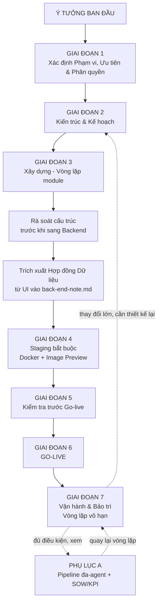
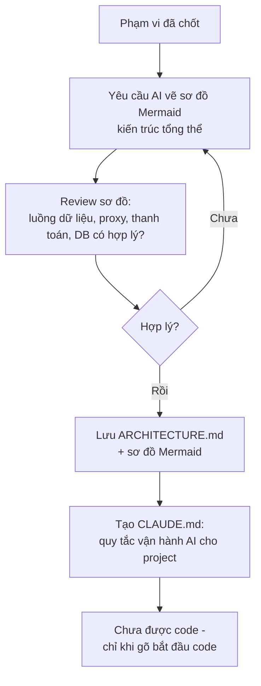
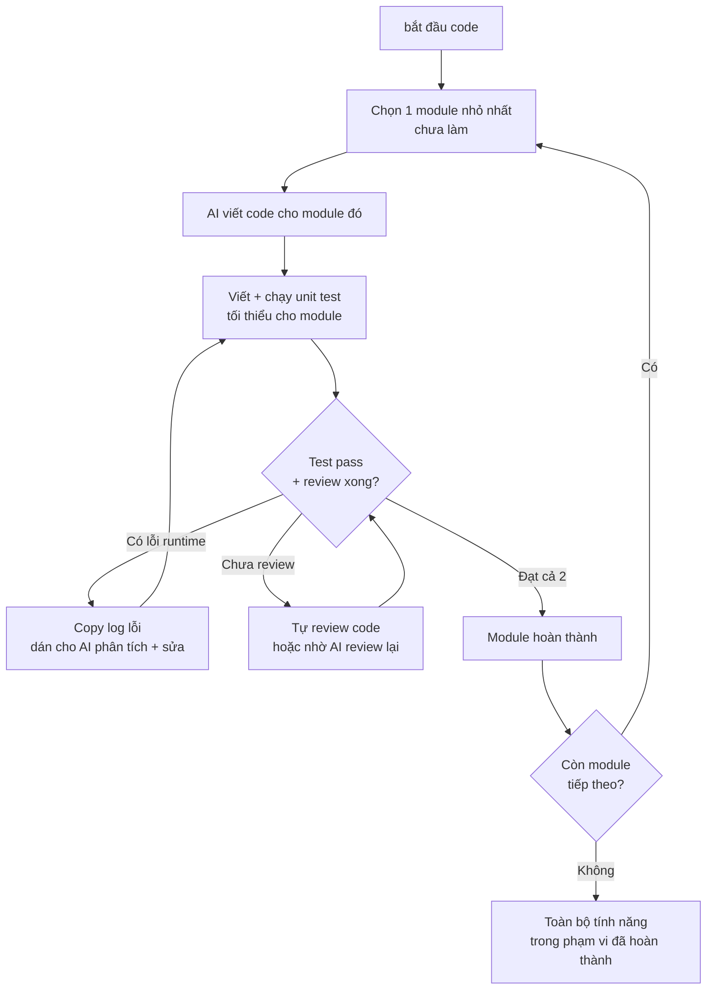
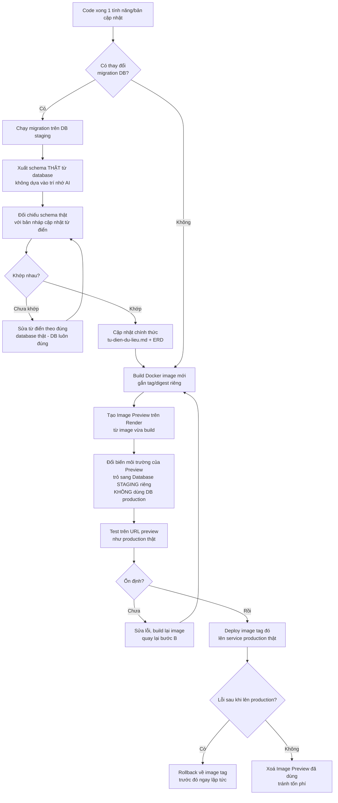
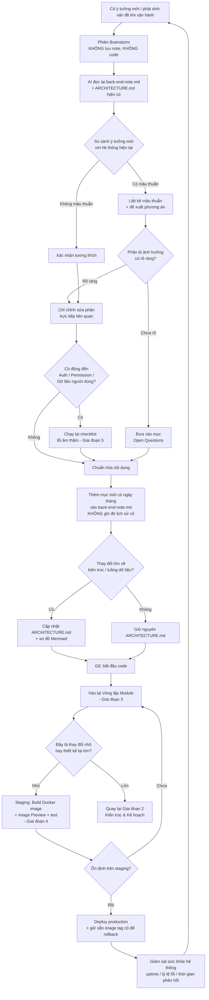
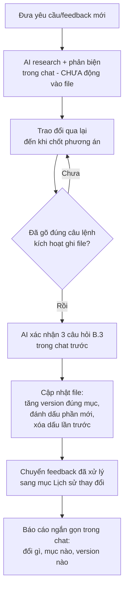

# Quy Trình Vibe-Code Chuẩn Hóa — Từ Ý Tưởng Đến Go-Live

> File này là quy tắc vận hành **tổng thể**, áp dụng cho bất kỳ project nào, từ lúc có ý tưởng đến khi vận hành ổn định.
> Mỗi project tự sinh ra 3 file riêng theo quy trình này: `CLAUDE.md` (cấu hình hành vi AI), `back-end-note.md` (spec kỹ thuật), `ARCHITECTURE.md` (kiến trúc + sơ đồ Mermaid).
> Quy trình gồm **7 giai đoạn tuần tự** + **1 phụ lục điều kiện**, trong đó Giai đoạn 7 (Vận hành & Bảo trì) là một **vòng lặp con lặp lại vô hạn** sau khi go-live.

---

## Changelog — Lịch sử thay đổi quy trình này

> Áp dụng đúng nguyên tắc B.5: không ghi đè, ghi mục mới mỗi khi quy trình chính thay đổi.

| Phiên bản | Nội dung thay đổi chính | Ngày |
|---|---|---|
| v1.0 | Khởi tạo quy trình 6 giai đoạn ban đầu | |
| v2.0 | Đánh số lại tuần tự 1→7, tách nhánh đa-agent thành Phụ lục A, thêm nguyên tắc 7-9 (parity, rollback, không tự quyết) | |
| v2.1 | Thêm Giai đoạn 4 (Staging bắt buộc + Docker), Phụ lục B (Kiểm soát thay đổi), ERD/Từ điển dữ liệu, Provider Map, TASKS.md, Trích xuất Hợp đồng Dữ liệu, B.5 (Lịch sử thay đổi bắt buộc) | |
| v2.2 | Audit toàn diện: đồng bộ `CLAUDE-goc.md` với đầy đủ Mục 0 (thiếu nguyên tắc 6-8, 10), thêm Nguyên tắc 11 (bắt buộc đồng bộ 2 file), sửa bảng trích xuất Giai đoạn 3 khớp `back-end-note-cau-truc.md`, làm rõ quan hệ B.2/B.5, thêm nguồn "Mục lớn" cho TASKS.md | |
| v2.3 | Vá lỗ hổng "không biết backlog nằm ở đâu để bắt đầu code": `TASKS.md` chuyển từ "chỉ dùng khi nhiều người/tab" thành **backlog tổng bắt buộc mọi project**, khởi tạo cuối Giai đoạn 2; GĐ3 bước 1 trỏ thẳng vào `TASKS.md`; thêm gate-check bắt buộc cho 3 form điều kiện (`form-phan-quyen.md`, `provider-map.md`, `form-sow-kpi.md`) và ranh giới template gốc (`/templates`, read-only) vs file làm việc (root project) vào `CLAUDE-goc.md` | |
| v2.4 | Thêm module điều kiện thứ 4: `templates/api-integration-rules.md` (12 rule kỹ thuật bắt buộc khi có gọi API/dịch vụ ngoài — rate limit, circuit breaker, idempotency, secret, timeout, quota). Gate check của module (G1-G4, mọi lệnh gọi HTTP ra ngoài) rộng hơn gate cũ của `provider-map.md` (chỉ "nhiều provider AI") — nối 2 gate lại ở Giai đoạn 1/2, không để độc lập. Thêm bảng nghiệm thu R1-R12 vào checklist lỗi âm thầm Giai đoạn 5. Phân biệt rõ 🔴/🟡 "mức nghiêm trọng rule kỹ thuật" (module mới) khác trục với 🔴/🟡 "mức chặn tiến độ quyết định" (Mâu thuẫn/Open Questions) đã dùng trước đó | |

---

## 0. Nguyên tắc nền tảng

1. **Tách rời 2 pha:** brainstorm/ý tưởng và code là 2 hoạt động khác nhau — không code khi còn đang bàn ý tưởng.
2. **Note chỉ lưu 1 lần, sau khi đã chuẩn hóa** — không lưu bản nháp rồi sửa lại nhiều lần.
3. **AI phải đọc lại file cũ trước khi rà soát mâu thuẫn** — không suy đoán, không dựa vào trí nhớ tạm trong phiên.
4. **Giới hạn phạm vi chỉnh sửa** — chỉ sửa phần trực tiếp liên quan; phần chưa chắc chắn đưa vào "open questions".
5. **"Bắt đầu code" là câu lệnh kích hoạt duy nhất** để AI được phép viết mã nguồn.
6. **Go-live không phải điểm kết thúc** — mọi hệ thống sau go-live đều bước vào vòng lặp bảo trì liên tục.
7. **Môi trường nhất quán (parity):** local – staging – production phải cùng cấu hình (cùng Dockerfile, cùng biến môi trường dạng), tránh tình trạng "chạy được ở máy tôi nhưng lỗi trên server".
8. **Mọi thay đổi phải có khả năng rollback** — trước khi deploy bất kỳ bản cập nhật nào, phải xác nhận có đường quay lui về bản trước đó nếu lỗi.
9. **AI không được tự quyết các quyết định thực sự phải chốt** — kể cả quyết định kỹ thuật thuần túy (thiết kế API, chọn kiến trúc, chọn database...). Với quyết định ảnh hưởng trải nghiệm người dùng/quy tắc kinh doanh/chi phí: AI phải phân tích lý do, so sánh đánh đổi, đề xuất phương án tối ưu — trình bày bằng ngôn ngữ hậu quả kinh doanh (Business Logic), không dùng thuật ngữ kỹ thuật. Với quyết định kỹ thuật bắt buộc phải chốt: vẫn phải phân tích + trade-off + đề xuất như trên, nhưng được dùng thẳng thuật ngữ IT chuyên ngành. Chỉ chi tiết triển khai nhỏ không ảnh hưởng hành vi hệ thống (đặt tên biến, tổ chức file nội bộ...) mới được AI tự quyết mà không cần hỏi.
10. **Phát hiện mâu thuẫn phải ghi nhận ở MỌI giai đoạn (1→7), không riêng vòng lặp bảo trì.** Khi 2 quyết định đã chốt ở 2 thời điểm/giai đoạn khác nhau xung đột nhau (ví dụ: phạm vi ở Giai đoạn 1 nói không cần 1 tính năng, nhưng UI ở Giai đoạn 3 lại thiết kế tính năng đó), bắt buộc ghi vào mục "Mâu thuẫn & Cần làm rõ" trong `back-end-note.md` — không được AI tự ý âm thầm chọn 1 bên rồi làm tiếp. Phân loại 🔴 Chặn tiến độ (dừng lại xử lý ngay) hoặc 🟡 Có thể chốt sau (ghi nhận, tiếp tục việc khác, nhưng bắt buộc giải quyết trước khi qua Giai đoạn 5 — không mang mâu thuẫn vượt qua go-live). Đây khác với "Open Questions" (điều chưa quyết định) — mâu thuẫn là điều ĐÃ quyết định nhưng xung đột nhau.
11. **`CLAUDE-goc.md` phải đồng bộ với Mục 0 này** — mỗi khi thêm/sửa 1 nguyên tắc ở đây, bắt buộc cập nhật ngay `templates/CLAUDE-goc.md` tương ứng trong cùng lượt chỉnh sửa, không tách làm 2 việc riêng. Đây là nguyên tắc vá lỗi có thật đã từng xảy ra: văn bản quy trình đúng nhưng file cấu hình hành vi AI thực tế lại không được cập nhật theo.

---

## 1. Sơ đồ quy trình tổng thể (7 giai đoạn)

---

## 2. Chi tiết từng giai đoạn

### GIAI ĐOẠN 1 — Xác định Phạm vi, Ưu tiên & Phân quyền
*Làm trước khi vẽ bất kỳ sơ đồ kiến trúc nào.*

- Trả lời rõ: hệ thống giải quyết vấn đề gì, cho ai, ở quy mô nào (bao nhiêu người dùng dự kiến, tốc độ tăng trưởng).
- Liệt kê các nhóm chức năng, sau đó **xếp thứ tự ưu tiên** theo mức độ cần thiết — không mặc định làm hết mọi thứ ngay từ đầu.
- Quyết định các lựa chọn nền tảng ảnh hưởng lâu dài: ngôn ngữ/framework, database (ví dụ SQLite chỉ phù hợp quy mô nhỏ, cần Postgres/MySQL nếu dự kiến traffic cao), hosting, **provider AI/thư viện chính** (ví dụ: provider sinh ảnh/AI content/gửi email...) — đây là quyết định khó đảo ngược, ảnh hưởng chi phí và rủi ro thật (rate limit, chi phí theo lượt gọi), phải áp Nguyên tắc 9: phân tích trade-off, không tự chọn.
- **Thiết kế phân quyền (role-based access) ngay từ đầu nếu hệ thống có nhiều loại người dùng** — xác định rõ các vai trò (ví dụ: admin, người biên tập, người dùng thường), mỗi vai trò được làm gì/không được làm gì. Đây là quyết định nền tảng giống database — nếu để đến sau mới thiết kế, sẽ rất tốn công sửa lại toàn bộ luồng dữ liệu và giao diện.
- Đầu ra: 1 danh sách phạm vi đã được sắp xếp ưu tiên + các quyết định nền tảng đã chốt + bảng phân quyền (nếu có nhiều vai trò).
- **Form mẫu:** dùng `templates/form-xac-dinh-pham-vi.md` để điền, và `templates/form-phan-quyen.md` nếu có nhiều vai trò — copy nội dung đã điền vào `back-end-note.md` của project (khởi tạo `back-end-note.md` theo cấu trúc chuẩn ở `templates/back-end-note-cau-truc.md`, có sẵn mục "Mâu thuẫn & Cần làm rõ" tách riêng khỏi "Open Questions" — dùng xuyên suốt Giai đoạn 1→7 theo Nguyên tắc 10). Nếu có nhiều provider AI/dịch vụ bên thứ ba → dùng thêm `templates/provider-map.md`.
- **Gate bổ sung — Có gọi bất kỳ API/dịch vụ ngoài nào không (kể cả chỉ 1)?** Chạy gate check G1-G4 ở đầu `templates/api-integration-rules.md`: có gọi HTTP ra ngoài, có SDK bên thứ ba gọi mạng ngầm (Firebase, Stripe, OpenAI...), có webhook/cron/worker gọi ra ngoài, hoặc có scrape/crawl/poll dữ liệu ngoài. **Gate này rộng hơn gate của `provider-map.md`** — chỉ cần 1 provider duy nhất, không cần "nhiều provider", đã đủ kích hoạt. Nếu có ít nhất 1 `CÓ`: bắt buộc dùng **cả 2** file — `provider-map.md` (kê danh sách provider, chi phí, dự phòng) **và** `templates/api-integration-rules.md` (12 nguyên tắc kỹ thuật bắt buộc: rate limit, circuit breaker, idempotency, secret, timeout, quota) — không dùng 1 trong 2 rồi bỏ qua file kia.
- **Gate bổ sung:** trả lời câu hỏi — *"Project này có khả năng cần nhánh Pipeline đa-agent với tối ưu KPI không (xem Phụ lục A)?"* Mặc định là KHÔNG trừ khi cả 3 điều kiện kích hoạt ở Phụ lục A đều đúng — và điều đó thường chỉ xác nhận được sau khi hệ thống đã vận hành một thời gian (Giai đoạn 7), không phải ngay từ đầu.

⚠️ Bỏ qua giai đoạn này là nguyên nhân phổ biến nhất khiến hệ thống bị overbuild (xây thừa) hoặc chọn sai công nghệ nền tảng ngay từ đầu, rất tốn công sửa về sau.

### GIAI ĐOẠN 2 — Kiến trúc & Kế hoạch

- AI phác thảo kiến trúc bằng Mermaid dựa trên phạm vi đã chốt ở Giai đoạn 1.
- Bạn đóng vai trò kiến trúc sư kiểm duyệt — không tự vẽ tay, nhưng phải đọc và duyệt từng luồng dữ liệu trước khi chấp nhận.
- Tạo `CLAUDE.md` ngay tại đây: copy từ `templates/CLAUDE-goc.md` (chứa sẵn các quy tắc gốc: kích hoạt bằng "bắt đầu code", không tự quyết định thay bạn, đọc lại file cũ trước khi rà soát, giới hạn phạm vi sửa...), sau đó bổ sung quy tắc riêng của project nếu có.
- **`ARCHITECTURE.md` có sẵn mục "Lịch sử thay đổi kiến trúc" ngay từ khi tạo lần đầu** (để trống ban đầu) — mọi lần cập nhật kiến trúc sau này (Giai đoạn 7) đều ghi vào đây trước, không ghi đè sơ đồ cũ, theo đúng Phụ lục B.5.
- **Chưa được code ở giai đoạn này**, kể cả khi kiến trúc đã chốt — chỉ chuyển sang Giai đoạn 3 khi gõ "bắt đầu code".
- **Công cụ xem sơ đồ:** dùng `Ctrl+K V` (Mac: `Cmd+K V`) để xem preview song song khi AI đang viết/sửa sơ đồ Mermaid trong `ARCHITECTURE.md`. Cần chỉnh tay chi tiết → tách sang file `.mmd` tạm với extension Mermaid Chart, xong dán lại vào `.md` chính.
- **Kiểm soát thay đổi:** áp dụng Phụ lục B (Giao thức Kiểm soát Thay đổi) ngay từ khi tạo `ARCHITECTURE.md` — không tự sửa/xóa nội dung đã chốt, mọi đề xuất đi vào mục riêng chờ duyệt.
- **Bọc provider sau lớp trung gian (adapter):** nếu gate check G1-G4 ở `templates/api-integration-rules.md` có ít nhất 1 `CÓ` (xem Giai đoạn 1), kiến trúc phải thể hiện rõ 1 lớp trung gian (`api_client`) đứng giữa nghiệp vụ chính và mọi provider/API ngoài — nghiệp vụ không gọi thẳng vào provider (R1 — Single Egress). Đây là nguyên tắc kỹ thuật bắt buộc, không phải tùy chọn. **Trước khi được phép gõ "bắt đầu code"**, phải hoàn thành Mục 2-4 của `api-integration-rules.md` (12 nguyên tắc R1-R12 đã có phương án triển khai + form khai báo Mục 4 đã điền đủ: danh sách dịch vụ, bảng endpoint, bảng mã lỗi, ngưỡng cấu hình) — lưu bản điền thành file riêng `api-integration-rules.md` ở root project.
- **Thiết kế database formal:** vẽ **ERD (Entity Relationship Diagram)** bằng Mermaid (`erDiagram`) ngay trong `ARCHITECTURE.md`, thể hiện quan hệ giữa các bảng. Song song, tạo `templates/tu-dien-du-lieu.md` → điền thành `tu-dien-du-lieu.md` riêng của project — là **nguồn duy nhất** định nghĩa ý nghĩa mọi trường, chống hiểu nhầm giữa các function khi hệ thống có nhiều bảng.
- **Trigger riêng cho ERD/Từ điển dữ liệu (không gộp với "thay đổi lớn kiến trúc"):** bất kỳ thay đổi migration nào (thêm/xóa/sửa bảng hoặc trường), dù nhỏ, đều **bắt buộc** cập nhật ERD + Từ điển dữ liệu ngay lập tức — không được dồn lại "để sau" vì đây là nguồn chống sai lệch logic duy nhất giữa các module.

**Bước bắt buộc cuối Giai đoạn 2 — Khởi tạo TASKS.md làm Backlog tổng:**
*Trả lời câu hỏi "toàn bộ danh sách công việc nằm ở đâu để bắt đầu code" — bắt buộc với MỌI project, kể cả chỉ 1 người code, không riêng trường hợp nhiều người/tab song song.*

- Sau khi `ARCHITECTURE.md` chốt xong, copy `templates/TASKS.md` thành `TASKS.md` của project.
- AI liệt kê toàn bộ task cần làm (frontend + backend), nhóm theo "Mục lớn" — đối chiếu 2 nguồn theo đúng quy tắc 11 của `TASKS.md`: danh sách chức năng ưu tiên ở `form-xac-dinh-pham-vi.md` (GĐ1) **kết hợp** với các module trong `ARCHITECTURE.md` (GĐ2).
- Mỗi task gán mã việc (`{Mã project}-{4 số}`), trạng thái mặc định 🔓, điền cột "Phụ thuộc vào (mã)" nếu có.
- Đây chính là nơi bạn "gọi ra" danh sách việc cần làm ở Giai đoạn 3 — không phải bịa lại mỗi lần hỏi AI "giờ làm gì tiếp".

### GIAI ĐOẠN 3 — Xây dựng (Vòng lặp module)

- Chia nhỏ để trị — không yêu cầu AI code toàn bộ app cùng lúc.
- **"Chọn 1 module nhỏ nhất chưa làm" = mở `TASKS.md`, lọc các dòng 🔓, ưu tiên việc không phụ thuộc gì hoặc có phụ thuộc đã ✅.** Đây là bước tra cứu bắt buộc, không tự chọn module theo cảm tính hoặc theo trí nhớ tạm của phiên chat.
- **Tiêu chí "module hoàn thành" (Definition of Done)** — cả 2 điều kiện phải đạt trước khi sang module tiếp theo:
  1. Có **unit test tối thiểu** cho phần logic chính của module (không cần phủ 100%, nhưng phải test được các trường hợp cơ bản và các trường hợp biên quan trọng).
  2. Đã **review lại code** (tự đọc hoặc yêu cầu AI review chéo) trước khi coi là xong — không chuyển sang module kế tiếp chỉ vì "chạy không lỗi".
- Vòng lặp tự chữa lành (auto-healing): dán nguyên văn lỗi terminal cho AI, không cần tự hiểu lỗi là gì.
- **`TASKS.md` đã khởi tạo từ cuối Giai đoạn 2** — checklist công việc với mã việc duy nhất, trạng thái 🔓/🔒/✅/❌, nhóm việc theo file/module không giao nhau để tránh conflict khi merge. **Nhiều người/tab code song song:** mỗi tab/người tự chọn 1 branch riêng (đã có sẵn), cập nhật trạng thái ngay khi bắt đầu và khi xong việc trong `TASKS.md` — cơ chế khóa 🔓→🔒 trước khi code là **bắt buộc nghiêm ngặt** trong trường hợp này để tránh 2 người đụng cùng 1 việc; nếu chỉ 1 người/1 tab code, vẫn dùng `TASKS.md` làm backlog tổng nhưng có thể nới lỏng bước khóa.

**Bước bắt buộc cuối Giai đoạn 3 — Rà soát cấu trúc trước khi sang backend:**
*Áp dụng khi frontend (hoặc phần vừa code xong) đã hoàn thành với mock data, trước khi bắt đầu code backend thật. Mục đích: đảm bảo cấu trúc dễ sửa/scale, và việc nối backend sau này chỉ là "thay nguồn dữ liệu" chứ không phải sửa lại từng trang.*

AI rà soát theo 6 tiêu chí sau và **chỉ xuất báo cáo, không tự sửa gì**:

| Tiêu chí | Câu hỏi kiểm tra |
|---|---|
| Tách lớp dữ liệu (quan trọng nhất) | Mock data có nằm tập trung 1 chỗ (dễ thay bằng API thật), hay rải rác hard-code khắp các trang? |
| Component trùng lặp | Có bao nhiêu component làm chức năng giống nhau nhưng viết riêng lẻ mỗi nơi, chưa gộp thành 1 component dùng chung? |
| Cấu trúc thư mục nhất quán | Tổ chức theo 1 kiểu duy nhất (theo tính năng hoặc theo loại file) — không lẫn lộn 2 kiểu trong cùng project? |
| Đối chiếu với ARCHITECTURE.md | Cấu trúc thư mục thực tế có khớp với sơ đồ kiến trúc đã chốt không, hay đã lệch dần trong lúc code? |
| File/code không dùng đến | Có file, import, hoặc đoạn code đã viết nhưng không còn dùng (dead code) không? |
| Đặt tên nhất quán | Quy ước đặt tên component/file có thống nhất xuyên suốt không? |

**Quy trình xử lý (đúng Nguyên tắc 9 — AI không tự quyết):**
1. AI rà soát theo 6 tiêu chí trên → xuất báo cáo, chưa sửa gì.
2. Với mỗi vấn đề tìm thấy → nêu rõ hậu quả nếu không sửa + đề xuất phương án + đánh đổi.
3. Người dùng duyệt từng đề xuất.
4. AI chỉ thực thi phần đã duyệt, qua đúng vòng lặp module + staging (Giai đoạn 4) như bình thường trước khi merge.

Chỉ chuyển sang bước tiếp theo sau khi bước rà soát này hoàn tất và các đề xuất đã được xử lý.

**Bước bắt buộc thứ 2 cuối Giai đoạn 3 — Trích xuất Hợp đồng Dữ liệu từ UI (làm sau khi rà soát cấu trúc xong):**
*Đảm bảo backend bắt buộc phục vụ đúng những gì giao diện đã chốt, không phải thiết kế backend dựa trên trí nhớ rời rạc của AI về UI.*

AI phải **đọc lại toàn bộ giao diện đã chốt** (không dựa vào trí nhớ tạm của phiên), rồi trích xuất vào đúng 5 mục tương ứng trong `back-end-note.md` (theo cấu trúc `templates/back-end-note-cau-truc.md`):

| Mục trong back-end-note.md | Nội dung cần trích xuất |
|---|---|
| 1. UI Behavior | Mỗi màn hình có hành vi tương tác gì (bấm, kéo, chuyển trang...) |
| 2. Data Shape | Mỗi màn hình cần những trường dữ liệu gì, kiểu gì |
| 3. Draft API needs | Suy ra từ hành vi ngầm định của UI: lọc/sắp xếp/tìm kiếm/phân trang cần API dạng nào (input/output) — đây là bản nháp, chưa phải thiết kế API chính thức (việc đó chốt ở Giai đoạn 2/4 theo Nguyên tắc 9) |
| 4. Validation Rules | Giới hạn nhập liệu đã thể hiện trên UI (bắt buộc, độ dài, định dạng...) |
| 5. Edge Cases | Trạng thái rỗng, lỗi, loading đã thiết kế trên UI — backend cần trả đúng dạng dữ liệu để hiển thị đúng |

Chỗ nào UI mơ hồ về hành vi dữ liệu, chưa rõ nên hỏi trước khi code backend → ghi vào mục 6 (Open Questions) của `back-end-note.md`, không lẫn vào 5 mục trên.

- Sau khi trích xuất xong → áp dụng Phụ lục B (chuẩn hóa, lưu 1 lần, có version) vào `back-end-note.md`.
- **Bảng này là "khế ước"** — backend bắt buộc tuân theo, không tự ý đổi khác. Nếu backend phát hiện điều gì trong bảng bất khả thi hoặc không tối ưu, phải quay lại đề xuất sửa UI (áp dụng Nguyên tắc 9 — phân tích trade-off, không tự ý làm khác đi).

Chỉ chuyển sang Giai đoạn 4/backend sau khi CẢ 2 bước bắt buộc trên (rà soát cấu trúc + trích xuất hợp đồng dữ liệu) đã hoàn tất.

### GIAI ĐOẠN 4 (BẮT BUỘC) — Staging trước khi đưa vào Production
*Áp dụng cho MỌI project, cả lần go-live đầu tiên (trước Giai đoạn 5) lẫn mọi lần cập nhật sau này (trong Giai đoạn 7). Đây là bước chèn giữa "code xong" và "deploy production" để không gián đoạn hệ thống đang chạy thật.*

**Việc thiết lập 1 lần duy nhất (không lặp lại mỗi lần deploy):**
1. Tạo 1 **database staging riêng biệt**, không dùng chung với production — kể cả khi đang dùng SQLite.
2. Dùng **cùng 1 Dockerfile** cho local – staging – production, đảm bảo test đúng thứ sẽ chạy thật.
3. Nếu vẫn dùng SQLite: xác nhận rõ dữ liệu có được lưu qua Persistent Disk (không mất khi container restart) — đây là thời điểm hợp lý để quyết định dứt điểm có chuyển sang Postgres/MySQL hay không, thay vì vá tạm.
4. **Health check endpoint** (ví dụ `/health`): tạo 1 endpoint đơn giản trả về trạng thái "OK" để Render (hoặc hạ tầng đang dùng) biết chính xác khi nào container mới thực sự sẵn sàng nhận traffic — tránh downtime lúc chuyển đổi giữa bản cũ và bản mới.
5. Tạo file **`.env.example`**: liệt kê tên các biến môi trường cần thiết (không chứa giá trị thật) — giúp thiết lập nhanh môi trường staging mới hoặc khi cần tái tạo hệ thống, tránh thiếu sót biến môi trường.

**Quy trình lặp lại mỗi lần có bản cập nhật:**

- **Gate bắt buộc — Từ điển dữ liệu phải được xác minh với database thật, không chỉ viết ra rồi tin:** nếu bản cập nhật có thay đổi migration, KHÔNG được qua bước build Docker image cho đến khi đã xuất schema thật từ database (không dựa vào trí nhớ AI) và đối chiếu khớp với `tu-dien-du-lieu.md`. Nguyên tắc: **database thật luôn là chân lý** — nếu lệch, sửa từ điển theo database, không phải ngược lại.
- **Preview instance mặc định sao chép toàn bộ biến môi trường từ service gốc, kể cả thông tin kết nối database** — bắt buộc phải tự đổi sang database staging, nếu không sẽ vô tình test trên dữ liệu thật.
- Render không tự động xoá image preview — phải tự xoá sau khi dùng xong để tránh phát sinh phí.
- Với thay đổi động đến cấu trúc database: ưu tiên thay đổi tương thích ngược (ví dụ thêm cột mới thay vì xoá/đổi tên cột cũ ngay) để code cũ và mới đều chạy được trong lúc chuyển tiếp.
- Luôn giữ sẵn image tag của bản trước để rollback ngay nếu bản mới lỗi sau khi lên production.

**📌 Điểm nâng cấp sau (chưa cần làm ngay):** khi quy trình thủ công ở giai đoạn này đã chạy ổn định qua nhiều lần cập nhật, có thể cân nhắc tự động hóa bằng CI/CD (ví dụ GitHub Actions tự gọi Render API build + tạo Image Preview + deploy) thay vì làm tay từng bước. Chỉ nên tự động hóa sau khi quy trình thủ công đã chứng minh hiệu quả và bạn đã quen thuộc với từng bước — tự động hóa quá sớm khi chưa hiểu rõ quy trình sẽ khó debug khi có sự cố.

### GIAI ĐOẠN 5 — Kiểm tra trước Go-live
*Bước hay bị bỏ qua nhất vì các lỗi ở đây không tự hiện ra trên terminal.*

Checklist lỗi âm thầm — bắt buộc rà trước khi go-live, đặc biệt nếu hệ thống có auth, thanh toán, hoặc dữ liệu người dùng:

| # | Lỗi âm thầm | Câu hỏi kiểm tra |
|---|---|---|
| 1 | Secrets lộ trong code | API key, mật khẩu có nằm trực tiếp trong file code không? |
| 2 | Bảo mật giả | Có kiểm tra quyền ở phía server, hay chỉ ẩn nút ở giao diện? |
| 3 | Rò rỉ dữ liệu giữa người dùng | User A có thể vô tình thấy dữ liệu của User B không? (đặc biệt quan trọng nếu có phân quyền nhiều vai trò từ Giai đoạn 1) |
| 4 | Thiếu ghi log lỗi | Khi lỗi xảy ra, có được ghi lại để debug sau không? |
| 5 | Backup không đủ | Dữ liệu có được sao lưu định kỳ trước khi go-live? |
| 6 | Backup chưa từng được test khôi phục | Đã thử khôi phục thử từ bản backup ít nhất 1 lần chưa? Backup tồn tại nhưng chưa test khôi phục không đảm bảo dùng được khi thật sự cần. |
| 7 | Lỗ hổng thanh toán | Luồng thanh toán có được xác thực đúng cách 2 chiều? |
| 8 | AI thay đổi không giám sát | Toàn bộ code có được review trước khi merge? |
| 9 | Tối ưu sai chỉ số (local metric lệch business outcome) | Chỉ áp dụng nếu có Phụ lục A — agent đạt KPI riêng có đi cùng chiều với North Star Metric không? Đã có holdout để xác nhận nhân quả chưa? |
| 10 | Bỏ qua staging, deploy thẳng lên production | Đã build Docker image, test trên Image Preview với database staging riêng, xác nhận ổn định trước khi deploy thật chưa? |
| 11 | Thiếu health check endpoint | Hệ thống có endpoint `/health` để hạ tầng biết chính xác khi nào container sẵn sàng nhận traffic chưa? |
| 12 | Từ điển dữ liệu lệch khỏi database thật (lệch tích lũy) | Đã audit toàn bộ `tu-dien-du-lieu.md` đối chiếu với schema thật của database — không chỉ trường vừa đổi gần nhất — để bắt các lệch nhỏ cộng dồn qua nhiều lần cập nhật chưa? |
| 13 | Còn mâu thuẫn chưa giải quyết | Kiểm tra mục "Mâu thuẫn & Cần làm rõ" trong `back-end-note.md` — còn dòng nào (kể cả 🟡) chưa giải quyết không? Không được go-live nếu còn mâu thuẫn tồn đọng, kể cả loại 🟡. |
| 14 | Rủi ro kỹ thuật khi gọi API ngoài chưa được nghiệm thu | Chỉ áp dụng nếu gate check `api-integration-rules.md` (Mục 0) trả về ít nhất 1 `CÓ` ở Giai đoạn 1 — đã chạy Bảng nghiệm thu Mục 5 (R1-R12) trong context sạch chưa? Còn dòng `FAIL` nào ở mức 🔴 Blocker không? Không được go-live nếu còn FAIL 🔴; FAIL 🟡 phải đã ghi vào `TASKS.md` nhãn `tech-debt` kèm ngày xử lý. |

Ngoài checklist, xác nhận thêm: domain/hosting đã sẵn sàng, biến môi trường (environment variables) đã cấu hình đúng cho production, có kế hoạch rollback nếu go-live lỗi (đã có image tag trước đó sẵn sàng). Nếu có Phụ lục A, xác nhận thêm: cơ chế cảnh báo lệch KPI/North Star đã hoạt động, và tối ưu tự động chỉ bật cho 1 agent đầu tiên (chưa bật đồng loạt).

### GIAI ĐOẠN 6 — Go-live
- Triển khai lên môi trường production.
- Xác nhận hệ thống chạy đúng như kỳ vọng ở quy mô thật (không chỉ ở local/dev).
- Ghi nhận thời điểm go-live và version đã triển khai vào `ARCHITECTURE.md`.

### GIAI ĐOẠN 7 — Vận hành & Bảo trì (vòng lặp vô hạn)
*Đây là quy trình xử lý mọi ý tưởng mới / lỗi phát sinh sau go-live — lặp lại liên tục trong suốt vòng đời hệ thống.*

**Bước bên trong vòng lặp bảo trì:**

1. **Brainstorm** — trao đổi tự do, không lưu note, không code.
2. **Rà soát mâu thuẫn** — bắt buộc yêu cầu AI đọc lại `back-end-note.md` + `ARCHITECTURE.md` hiện có, không suy đoán trong trí nhớ tạm của phiên. **Đây là cùng 1 cơ chế đã áp dụng xuyên suốt từ Giai đoạn 1 (Nguyên tắc 10), không phải cơ chế riêng của Giai đoạn 7** — chỉ khác là ở đây áp dụng cho ý tưởng mới phát sinh sau go-live. Prompt mẫu:
   > "Đọc lại back-end-note.md và ARCHITECTURE.md hiện tại, sau đó so sánh với ý tưởng vừa bàn. Liệt kê mọi điểm mâu thuẫn hoặc phần cần điều chỉnh."
3. **Giới hạn phạm vi** — chỉ sửa phần trực tiếp liên quan; phần chưa chắc chắn → "Open Questions", không lan phạm vi.
4. **Checklist lỗi âm thầm (Giai đoạn 5)** — chạy lại nếu thay đổi động đến auth/permission/dữ liệu.
5. **Chuẩn hóa & lưu note** — thêm mục mới có ngày tháng vào `back-end-note.md`, **không ghi đè lịch sử cũ**, để giữ được lý do các quyết định trước đó khi cần tra lại. Áp dụng đầy đủ Phụ lục B (Giao thức Kiểm soát Thay đổi) trước khi ghi: xác nhận rõ mục nào giữ nguyên, mục nào sửa, mục nào xóa.
6. **Cập nhật kiến trúc** nếu thay đổi ảnh hưởng luồng dữ liệu tổng thể — nếu là thiết kế lại lớn, quay về Giai đoạn 2 thay vì đi thẳng vào code. **Không ghi đè sơ đồ cũ** — thêm mục "Lịch sử thay đổi kiến trúc" cuối `ARCHITECTURE.md`, ghi rõ sơ đồ/thiết kế cũ và mới kèm ngày + lý do đổi, trước khi cập nhật sơ đồ Mermaid chính. Riêng ERD + `tu-dien-du-lieu.md`: bất kỳ thay đổi migration nào (thêm/xóa/sửa bảng hoặc trường) đều bắt buộc cập nhật ngay, không phụ thuộc vào việc thay đổi đó có được coi là "lớn" hay không — đây là trigger riêng, tách biệt khỏi tiêu chí "thay đổi lớn kiến trúc".
7. **Gõ "bắt đầu code"** → quay lại vòng lặp module ở Giai đoạn 3.
8. **Staging bắt buộc (Giai đoạn 4)** — build Docker image, tạo Image Preview trên Render với database staging riêng, test ổn định trước khi deploy thật. Không bỏ qua bước này kể cả với thay đổi nhỏ.
9. **Deploy production**, giữ sẵn image tag trước đó để rollback ngay nếu lỗi.
10. **Giám sát sức khỏe hệ thống nền tảng** sau mỗi lần deploy: theo dõi uptime, tỷ lệ lỗi (error rate), thời gian phản hồi (response time) — không chỉ chờ người dùng báo lỗi mới biết có sự cố. **Nếu có provider AI tính phí theo lượt gọi (xem `provider-map.md`): giám sát thêm chi phí gọi API tích lũy**, tránh lỗi logic gọi lặp vô hạn gây phát sinh chi phí lớn mà không ai biết. Quay lại đầu vòng lặp.

**Nếu project đủ điều kiện áp dụng Phụ lục A (Pipeline đa-agent):** thêm 1 nhánh định kỳ song song — đối chiếu KPI từng agent với North Star Metric mỗi chu kỳ; nếu lệch (agent đạt KPI nhưng North Star giảm liên tục và holdout xác nhận không do yếu tố ngoài) → hệ thống cảnh báo, con người review và quyết định reset KPI, không tự động hóa bước reset.

---

## 3. Vai trò của 4 file cố định (không trùng lặp)

| File | Vai trò | Khi nào cập nhật |
|---|---|---|
| `CLAUDE.md` | Quy tắc vận hành AI (khi nào code, khi nào hỏi, ranh giới hành vi) | Tạo ở Giai đoạn 2, sửa khi quy tắc làm việc thay đổi |
| `back-end-note.md` | Spec kỹ thuật chi tiết theo từng buổi thiết kế. **Ghi theo kiểu nối thêm (append) có ngày tháng, không ghi đè** — giữ lại lịch sử quyết định để tra cứu lý do các lựa chọn cũ khi cần | Cuối mỗi vòng lặp Giai đoạn 7 |
| `ARCHITECTURE.md` | Kiến trúc tổng thể + sơ đồ Mermaid | Tạo ở Giai đoạn 2, cập nhật khi thay đổi lớn |
| `TASKS.md` | **Backlog tổng + tracker sống** — trả lời "còn bao nhiêu việc, việc nào làm tiếp". Khác `back-end-note.md` ở chỗ cập nhật tự do ngay lập tức, không chờ trigger "chuẩn hóa và lưu" | Khởi tạo cuối Giai đoạn 2, cập nhật liên tục xuyên suốt Giai đoạn 3 và mỗi vòng lặp Giai đoạn 7 |

---

## 4. Lỗi thường gặp cần tránh

- ❌ Vẽ kiến trúc ngay từ ý tưởng thô, bỏ qua bước xác định phạm vi & ưu tiên → dễ overbuild hoặc chọn sai công nghệ nền tảng.
- ❌ Coi go-live là điểm kết thúc, không thiết lập vòng lặp bảo trì rõ ràng → hệ thống dễ rơi vào trạng thái "vá lỗi ngẫu hứng" không kiểm soát.
- ❌ Lưu note ngay sau brainstorm rồi sửa lại lần 2 → tạo bản nháp rủi ro nếu bị gián đoạn giữa chừng.
- ❌ Rà soát mâu thuẫn mà không yêu cầu AI đọc lại file cũ → dễ bỏ sót xung đột thật với quyết định trước đó.
- ❌ Sửa lan sang phần không liên quan chỉ vì AI "phát hiện tiện thể" → mất kiểm soát phạm vi.
- ❌ Coi auto-healing (dán lỗi terminal) là đủ để đảm bảo an toàn → bỏ sót các lỗi âm thầm không hiển thị lỗi, đặc biệt nguy hiểm nếu bỏ qua trước go-live.
- ❌ Thay đổi lớn về kiến trúc nhưng vẫn đi thẳng vào code mà không quay lại Giai đoạn 2 → kiến trúc và thực tế code dần lệch nhau.
- ❌ Nhảy thẳng vào Continual RL / Multi-agent Swarm khi Contextual Bandit hoặc Batch Re-training đã đủ dùng → tăng độ khó, rủi ro, và chi phí giám sát không cần thiết.
- ❌ Để nhiều agent tự tối ưu đồng thời từ đầu, không có North Star Metric hay holdout → không phát hiện được khi agent tối ưu sai chỉ số (đạt KPI riêng nhưng hại kết quả kinh doanh thật).
- ❌ Tự động hóa việc reset KPI ngay từ đầu → rủi ro cấp 2: hệ thống tự sửa cách đo lường của chính nó mà không ai giám sát.
- ❌ Deploy thẳng bản cập nhật lên production mà không qua staging, kể cả với thay đổi "nhỏ" → mất khả năng phát hiện lỗi trước khi ảnh hưởng người dùng thật.
- ❌ Container hóa (Docker) mà vẫn dùng SQLite không có Persistent Disk → mất dữ liệu khi container restart, rủi ro nặng hơn so với chưa dùng Docker.
- ❌ Quên đổi biến môi trường của Image Preview sang database staging → vô tình test trên dữ liệu production thật.
- ❌ Không xoá Image Preview sau khi dùng xong → phát sinh phí không cần thiết vì Render không tự xoá.
- ❌ Không có health check endpoint → hạ tầng không biết chính xác khi nào container mới sẵn sàng, dễ gây downtime lúc chuyển đổi bản cũ/mới.
- ❌ Có backup định kỳ nhưng chưa từng test khôi phục → đến lúc cần dùng thật mới phát hiện backup không khôi phục được.
- ❌ Thêm/sửa nguyên tắc ở Mục 0 nhưng quên đồng bộ vào `templates/CLAUDE-goc.md` → văn bản quy trình đúng nhưng AI vận hành thực tế không biết áp dụng, vì AI chỉ đọc `CLAUDE.md` của project, không đọc lại toàn bộ file quy trình mỗi lần.

---

## Phụ lục A (ĐIỀU KIỆN) — Pipeline đa-agent với tối ưu hiệu suất qua SOW/KPI
*Nhánh này KHÔNG áp dụng mặc định, và KHÔNG phải 1 giai đoạn xảy ra trước khi build — nó chỉ được xét đến trong vòng lặp Giai đoạn 7, sau khi hệ thống đã vận hành đủ lâu để có dữ liệu thật. Chỉ kích hoạt khi project cụ thể thực sự cần nhiều AI agent phối hợp và tự tối ưu hiệu suất qua thời gian (ví dụ: agent thu thập – viết – đăng bài tự động, cần cải thiện cả hiệu suất từng agent lẫn kết quả kinh doanh tổng thể).*

**Điều kiện kích hoạt (cả 3 phải đúng — nếu thiếu 1, chưa làm nhánh này):**
1. Đã có pipeline đa-agent cố định chạy ổn định (mỗi agent làm đúng vai trò, không tự học) — đã qua Giai đoạn 3–6 của quy trình chính.
2. Đã tích lũy đủ dữ liệu phản hồi thật (view/click/chuyển đổi...) để đo lường có ý nghĩa.
3. Đã thử rule-based/heuristic thủ công trước và xác nhận không đủ hiệu quả.

**Form mẫu:** khi đủ 3 điều kiện trên, dùng `templates/form-sow-kpi.md` để điền SOW/KPI từng agent, North Star Metric, và thiết lập holdout — copy vào `back-end-note.md`.

**Vì sao không nhảy thẳng vào Continual Reinforcement Learning / Multi-agent Swarm:** đây là kiến trúc cấp nghiên cứu, đòi hỏi thiết kế reward function (dễ sai — agent học cách "lách" mục tiêu thay vì đạt mục tiêu thật), giám sát production liên tục, và rất khó debug vì hành vi nằm trong trọng số đã học chứ không phải 1 đoạn code cụ thể. Phần lớn nhu cầu "tối ưu qua phản hồi" thực chất giải được bằng Contextual Bandit hoặc Batch Re-training định kỳ — rủi ro thấp hơn nhiều, vẫn đạt hiệu quả tương đương.

**Rủi ro cốt lõi của nhánh này — bài toán quy kết đóng góp (attribution problem):** 1 agent có thể tự tối ưu để tăng chỉ số riêng của nó (ví dụ: agent viết dùng tiêu đề giật gân để tăng click) trong khi kết quả kinh doanh thật (chuyển đổi mua hàng) lại giảm. Không có gì báo lỗi — hệ thống "trông có vẻ đang cải thiện" nhưng thực chất đang tối ưu sai chỉ số.

**Thiết kế nhánh:**
- Mỗi agent có **SOW** (phạm vi công việc rõ ràng) + **KPI riêng** đo hiệu suất cục bộ.
- Có **1 chỉ số kinh doanh tổng (North Star Metric)** độc lập với KPI từng agent (ví dụ: doanh thu affiliate, tỷ lệ chuyển đổi thật).
- Có **nhóm đối chứng (holdout/control)**: giữ 1 phần không áp dụng tối ưu tự động, để phân biệt nhân quả thật với trùng hợp do yếu tố bên ngoài (mùa vụ, thay đổi thị trường...).
- **Chu kỳ đối chiếu định kỳ**: so KPI từng agent với North Star Metric.
- Nếu agent đạt KPI nhưng North Star giảm liên tục qua nhiều chu kỳ (và holdout xác nhận không phải do yếu tố ngoài) → **hệ thống chỉ cảnh báo, không tự sửa**.
- **Con người review và quyết định reset KPI** — chưa tự động hóa bước này ở giai đoạn đầu, để tránh rủi ro cấp 2 (hệ thống tự sửa cách đo lường của chính nó mà không ai giám sát).
- Bật tối ưu tự động **từng agent một**, xác nhận an toàn rồi mới mở rộng sang agent tiếp theo — không bật đồng loạt.

---

## Phụ lục B — Giao thức Kiểm soát Thay đổi (Change-Control Protocol)
*Áp dụng cho MỌI file đặc tả/checklist được tạo ra trong quy trình — cả Excel (`.xlsx`) lẫn Markdown (`back-end-note.md`, `ARCHITECTURE.md`). Mục tiêu: đảm bảo mỗi lần cập nhật không vô tình sửa/xóa mất nội dung đã chốt trước đó mà không ai biết.*

### B.1 — 6 nguyên tắc lõi (áp dụng mọi định dạng file)

| # | Nguyên tắc | Vì sao cần |
|---|---|---|
| 1 | **Không tự sửa/xóa nội dung đã chốt.** Phát hiện sai/thừa/cần đổi → ghi vào mục đề xuất riêng, chờ duyệt rõ ràng mới áp dụng. | Đây là hàng rào chính chống "sửa chỗ này mất chỗ kia" — AI không bao giờ được tự quyết thay bạn. |
| 2 | **Version theo từng hạng mục, không phải theo cả file.** Hạng mục nào đổi → tăng version của riêng hạng mục đó; hạng mục không đổi → giữ nguyên version cũ. | Cho phép biết chính xác 1 mục cụ thể đã qua bao nhiêu lần sửa, không bị trộn lẫn với các mục khác. |
| 3 | **Đánh dấu rõ phần vừa thay đổi trong lần cập nhật gần nhất**, và xóa dấu của lần trước đó khi có lần cập nhật mới — không tích lũy dấu qua nhiều lần. | Giúp nhìn lướt qua là biết ngay "lần này đổi gì", không phải so sánh thủ công toàn bộ file. |
| 4 | **Nhúng rules vào chính file** (sheet/mục "Quy tắc vận hành"). | Nếu phiên chat bị đứt hoặc mở phiên mới, chỉ cần gửi lại file là khôi phục được luật chơi — không phụ thuộc trí nhớ của phiên chat. |
| 5 | **Chỉ ghi file khi có đúng 1 câu lệnh kích hoạt cố định** — không suy ra từ ngữ cảnh. | Toàn bộ quá trình trao đổi, phản biện, thử phương án đều diễn ra trong chat trước; tránh việc AI ghi nhầm khi mới chỉ đang bàn bạc. |
| 6 | **Giữ lại lịch sử thay đổi**, không xóa vĩnh viễn nội dung feedback/quyết định cũ — chỉ chuyển từ khu vực "đang xử lý" sang khu vực "lịch sử". | Cho phép tra lại lý do 1 quyết định cũ bất kỳ lúc nào, không mất dấu vết. |

### B.2 — Áp dụng cụ thể theo định dạng file

| Nguyên tắc | Excel (`.xlsx`) | Markdown (`back-end-note.md`, `ARCHITECTURE.md`) |
|---|---|---|
| Đề xuất chờ duyệt | Cột riêng "Đề xuất back-end" trên sheet chính, hoặc 1 sheet "ĐỀ XUẤT" tổng hợp | 1 mục cuối file: "🔶 Đề xuất chờ duyệt" |
| Version từng hạng mục | Cột "Version" riêng mỗi dòng | Nhãn version nhỏ sau tên mục, ví dụ: `### Tên module [v1.2]` |
| Đánh dấu thay đổi | Tô nền đỏ/chữ trắng cho ô/dòng vừa đổi, xóa tô màu lần trước khi xuất bản mới | Ký hiệu cố định đầu dòng: `🆕` (mới thêm), `♻️` (đã sửa) — xóa ký hiệu ở lần cập nhật kế tiếp |
| Nhúng rules | Sheet "RULES" chứa nguyên văn | 1 mục đầu file: "Quy tắc vận hành file này" |
| Câu lệnh kích hoạt ghi file | **"Bổ sung file excel"** | **"Chuẩn hóa và lưu"** (đã dùng xuyên suốt quy trình chính) |
| Lịch sử thay đổi | Sheet "LỊCH SỬ THAY ĐỔI" | Mục "Lịch sử thay đổi" cuối file, ghi theo ngày, không xóa |

### B.3 — Bước xác nhận bắt buộc trước khi ghi đè (áp dụng mọi lần cập nhật)

Trước khi thực sự ghi vào file (Excel hoặc Markdown), AI phải trả lời 3 câu sau **trong chat**, không phải trong file — để bạn xác nhận trước khi cho phép ghi:

1. **Những mục nào giữ nguyên 100%** so với bản trước?
2. **Những mục nào thay đổi**, thay đổi cụ thể là gì?
3. **Có mục nào bị xóa không**, nếu có thì lý do?

Đây là lớp bảo vệ cuối cùng, tương tự nguyên tắc "phản biện trước, thực thi sau" nhưng áp dụng riêng cho hành động ghi file — không phải chỉ cho ý tưởng.

### B.4 — Quy trình làm việc mỗi lượt trao đổi (áp dụng khi thiết kế file đặc tả/checklist)

⚠️ Không được bỏ qua bước xác nhận B.3 dù chỉ là thay đổi nhỏ — đây chính là cơ chế duy nhất giúp bạn phát hiện kịp thời nếu AI hiểu sai phạm vi cần sửa trước khi nó trở thành 1 phần cố định trong file.

### B.5 — Nguyên tắc lịch sử thay đổi bắt buộc (áp dụng MỌI file đặc tả)

**Nguyên tắc chung:** mọi file đặc tả có thể thay đổi qua thời gian đều phải có đúng 1 mục **"Lịch sử thay đổi"** ở cuối file, cùng 1 cấu trúc cột cố định:

`[Định danh mục] | Loại thay đổi (➕ Thêm mới / ❌ Hủy-Xóa / ♻️ Sửa đổi) | Nội dung cũ | Nội dung mới | Lý do | Ngày`

Mục đích: khi hệ thống ban đầu làm theo phương án A, sau đó đổi sang phương án B, vẫn tra lại được lý do chọn A ban đầu và lý do đổi sang B — không mất dấu quyết định cũ.

**Cơ chế cập nhật khác nhau theo từng loại file (không dùng chung 1 kiểu để tránh hiểu nhầm):**

| File | Cơ chế cập nhật |
|---|---|
| `back-end-note.md`, `ARCHITECTURE.md`, `provider-map.md`, `form-xac-dinh-pham-vi.md`, `form-phan-quyen.md`, `form-sow-kpi.md`, `api-integration-rules.md` (bản điền riêng project) | Cần trigger **"chuẩn hóa và lưu"** — chỉ ghi khi đã chốt xong qua brainstorm |
| `tu-dien-du-lieu.md` | **Tự động ngay** khi xác minh khớp database thật (Giai đoạn 4) — đây là bước kỹ thuật xác định, không phải quyết định chủ quan cần chờ duyệt |
| `TASKS.md` — trạng thái công việc (🔓🔒✅❌) | Tự do, cập nhật ngay lập tức |
| `TASKS.md` — nội dung việc (thêm mới/hủy/sửa mô tả) | Ghi vào Lịch sử thay đổi ngay khi phát sinh, không chờ trigger |

**Riêng `tu-dien-du-lieu.md`:** giữ thêm cột Version theo từng dòng (khác các file còn lại) — vì các trường dữ liệu được tham chiếu trực tiếp trong code, cần 1 nhãn cố định để trỏ tới, không chỉ đối chiếu bằng ngày tháng.

**Lưu ý — B.2 và B.5 là 2 cơ chế bổ sung nhau, không thay thế nhau:** ký hiệu 🆕/♻️ ở B.2 là đánh dấu **tạm thời**, chỉ phản ánh thay đổi của lần cập nhật gần nhất, bị xóa ở lần sau (giúp nhìn lướt biết ngay lần này đổi gì). Bảng "Lịch sử thay đổi" ở B.5 là ghi chép **vĩnh viễn**, không bao giờ xóa (giúp tra lại toàn bộ lịch sử qua nhiều lần đổi). Mỗi lần cập nhật file, làm cả 2 việc: đánh dấu 🆕/♻️ tại chỗ thay đổi VÀ thêm 1 dòng vào bảng Lịch sử thay đổi.
